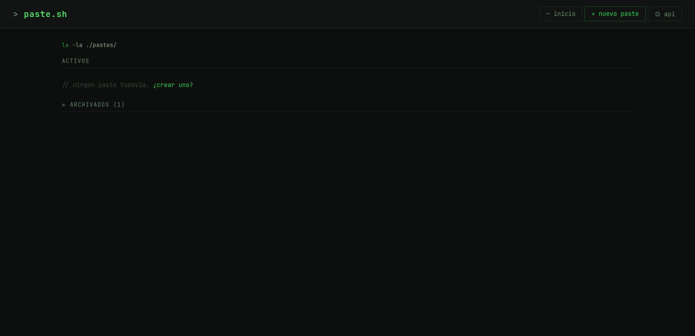
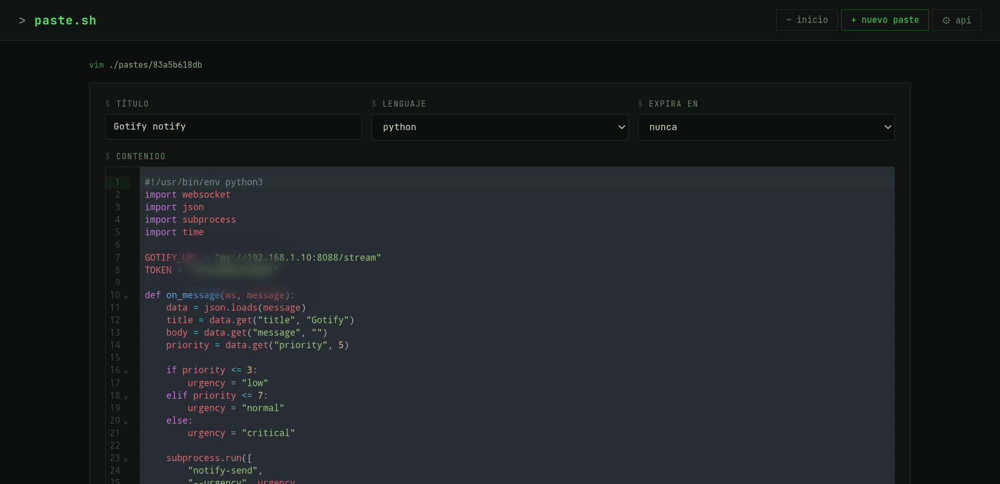
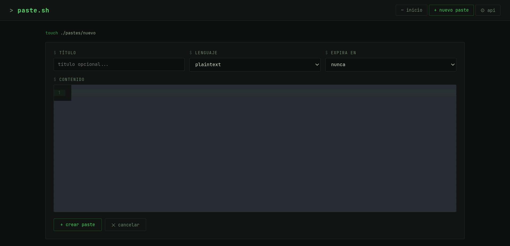
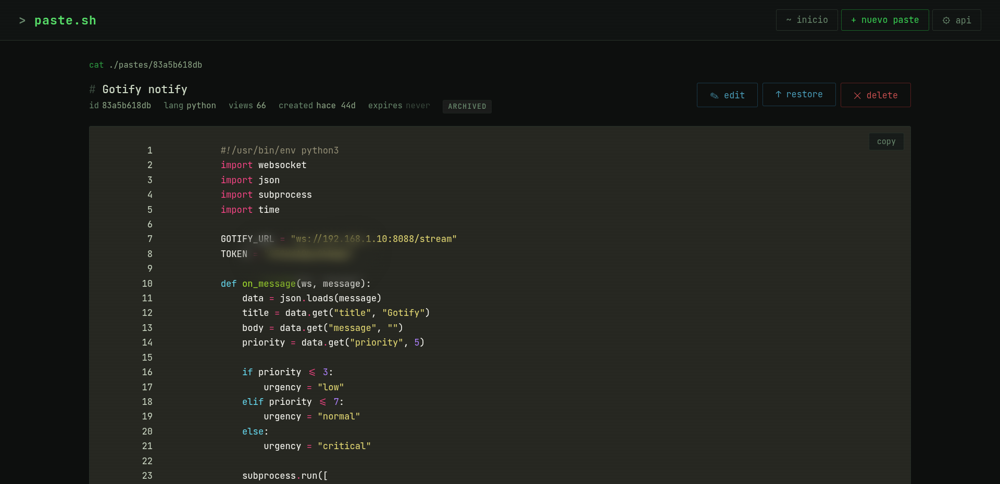

# paste.sh

Pastebin autoalojado con estética de terminal, construido con FastAPI y SQLite. Diseñado para homelabs y redes locales.






## Características

- Syntax highlighting con Pygments (tema Monokai)
- Expiración por TTL con limpieza automática
- Archivar/desarchivar pastes
- Descarga de pastes con la extensión correcta según el lenguaje
- Contador de vistas
- API REST
- Interfaz estilo terminal (verde sobre negro, fuente monoespaciada)
- Editor CodeMirror 6 con cambio de lenguaje en tiempo real

## Stack

- **Backend**: FastAPI + SQLite
- **Editor**: CodeMirror 6 (bundleado con esbuild)
- **Highlighting**: Pygments
- **Contenedor**: Docker (build multi-stage)


## Instalación

### 1. Clonar el repositorio

```bash
git clone https://codeberg.org/osdaeg/paste.sh
cd paste.sh
```

### 2. Copiar el yaml

```bash
cp docker-compose.yml.example docker-compose.yml
```

Editar `docker-compose.yml` con los valores correspondientes

### 3. Construir y levantar

```bash
docker compose up -d --build
```

El servidor queda disponible en `http://localhost:8090`.

## API

| Método | Endpoint | Descripción |
|--------|----------|-------------|
| `GET` | `/api/pastes` | Listar todos los pastes activos |
| `POST` | `/api/pastes` | Crear un paste |
| `PATCH` | `/api/pastes/{id}` | Actualizar un paste |
| `DELETE` | `/api/pastes/{id}` | Eliminar un paste |
| `POST` | `/api/pastes/{id}/archive` | Archivar un paste |
| `POST` | `/api/pastes/{id}/unarchive` | Desarchivar un paste |

### Crear un paste

```bash
curl -s -X POST http://localhost:8090/api/pastes \
  -H "Content-Type: application/json" \
  -d '{
    "title": "mi script",
    "content": "echo hola mundo",
    "language": "bash",
    "ttl_seconds": 604800
  }'
```

### Respuesta

```json
{
  "id": "a1b2c3d4",
  "title": "mi script",
  "content": "echo hola mundo",
  "language": "bash",
  "ttl_seconds": 604800,
  "created_at": 1710000000,
  "archived": false,
  "views": 0
}
```

Usar `ttl_seconds: null` para pastes que nunca expiran.

## Lenguajes soportados

`plaintext` `python` `bash` `javascript` `typescript` `json` `yaml` `toml` `html` `css` `sql` `go` `rust` `c` `cpp` `java` `kotlin` `ruby` `php` `markdown` `xml`

## Clientes

### paste.sh CLI

Cliente bash para usar desde la terminal o desde scripts de automatización post-descarga.

```bash
# Crear
paste new -t "mi script" -l bash -e 7d < script.sh

# Listar
paste ls

# Ver
paste cat <id>

# Descargar
paste dl <id> ~/Descargas/

# Eliminar
paste rm <id>
```

### [Pastedrop Android](https://codeberg.org/osdaeg/Pastedrop)

App Android offline-first. Se integra con el menú compartir del sistema — seleccioná texto en cualquier app, compartí a PasteDrop, y lo sube al servidor o lo guarda localmente si el servidor no está disponible.

- Cola offline con sync automático cuando el servidor vuelve
- Pull-to-refresh para traer los pastes del servidor
- Edición abriendo el servidor en el navegador
- Selección de lenguaje y TTL

### [Pastedrop Plasmoid](https://codeberg.org/osdaeg/pastedrop-plasmoid)

Widget de panel para KDE Plasma 6. Arrastrá texto sobre el widget para crear un paste al instante. La URL se copia al portapapeles automáticamente.

- URL del servidor, TTL y lenguaje predeterminado configurables
- Feedback visual (cargando, éxito, error)

## Estructura del proyecto

```
paste.sh/
├── app/
│   └── main.py          # Aplicación FastAPI
├── templates/
│   ├── base.html        # Layout base
│   ├── index.html       # Lista de pastes
│   ├── view.html        # Visor de pastes
│   └── edit.html        # Editor CodeMirror
├── cm-build/
│   ├── editor.js        # Entry point CodeMirror 6
│   └── package.json     # esbuild + dependencias CM6
├── Dockerfile           # Multi-stage: node (bundle) → python (servidor)
├── docker-compose.yml
└── requirements.txt
```

## Licencia

AGPL
